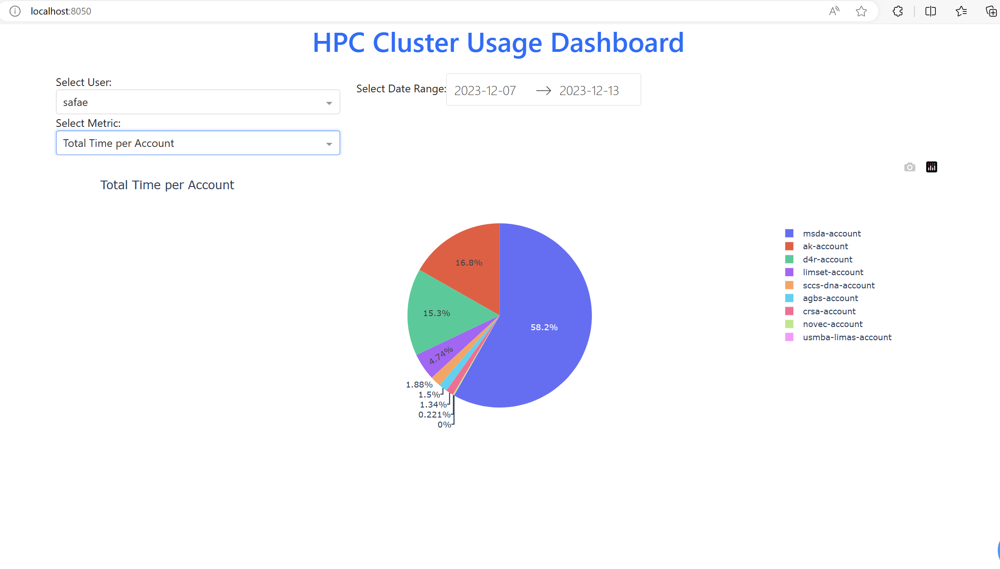

# HPC Cluster Usage Dashboard Project

## 1. Collecting Data with `sacctmgr`

### Objective
Gather detailed usage data from your HPC cluster.

### Steps
- **Learn `sacctmgr`**: Understand the command options and outputs to extract relevant data.
- **Scripting Regular Data Collection**:
  - Create a script to run `sacctmgr` at regular intervals.
  - Extract data like user IDs, CPU/GPU usage hours per user, and other pertinent metrics.
- **Data Storage**:
  - Choose between CSV file or database for storage.
  - Implement data appending or updating mechanism.

## 2. Data Analysis with Python

### Objective
Process and analyze the collected data.

### Tools
- Python
- Pandas library

### Steps
- **Data Loading**: Write Python code to load data.
- **Data Processing**: Use Pandas for cleaning, sorting, and aggregating data.

## Launching the Application

### Steps to Run the Dashboard
- **Navigate to Project Directory**:
  - Open a terminal.
  - The root directory should be `slurm_dashboard` and not `project`.
- **Run the Dashboard**:
  - Execute the dashboard application by running `python dashboard.py`.
  - Access the web interface as instructed in the output from the command.

  

## Remark

Note that other relevant data analysis was conducted in  `analysis.ipynb`. However, integrating them to the dashboard is to be done.
